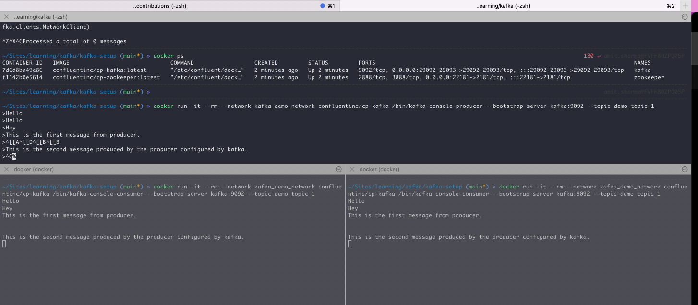

This repo is created for the kafka demo setup on local machine and can be used further.

Steps to configure

1. Clone the image.
2. Create containers using below command.
  `docker-compose up -d`
   Please note -d is used for detach mode.
3. Check if all the required containers are up.
4. To check if all good, create producer broker using below command
  `docker run -it --rm --network kafka_demo_network confluentinc/cp-kafka /bin/kafka-console-producer --bootstrap-server kafka:9092 --topic demo_topic_1`
5. Create consumer using below command.
  `docker run -it --rm --network kafka_demo_network confluentinc/cp-kafka /bin/kafka-console-consumer --bootstrap-server kafka:9092 --topic demo_topic_1`
6. Type some message on producer and see the message on consumer.

