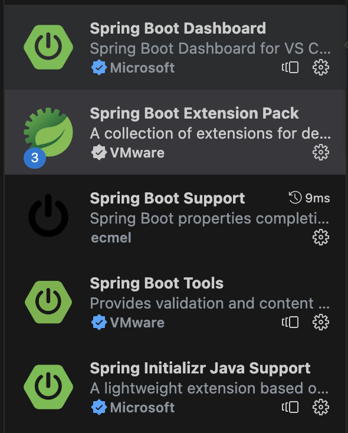

This repo is created for the basic demo of kafka producer and consumer in java. Can be considered as reference if required.

This is a java application based on Spring framework.

Files
1. Kafka Constants Interface
2. Main Application Class
3. Controllers
  1. Kafka Rest Controller
    - GET: /api/v1/message-producer?message=This is message
    - GET: /api/v1/message-consumer
  2. URL Check controller
    This is a REST controller created for site status, whether the given site url is up or down.
    GET: /check?url=https://www.google.com
4. Services
  1. KafkaConsumerCreator
  2. KafkaProducerCreator

Spring Setup

I have used VSCode setup to run spring API. Setup the VSCode for spring application.

1. Install the extensions shown in below image in VSCode.
   

2. Configure Spring. Go to VSCode settings and search for `spring.initializr.serviceUrl`
   and replace the configuration with `"spring.initializr.serviceUrl": "https://start.spring.io/",`
   

3. Open the JavaDemoApplication.java and Run the application.
4. Test the Producer API at http:8080//localhost/api/v1/message-producer?message=This is message
